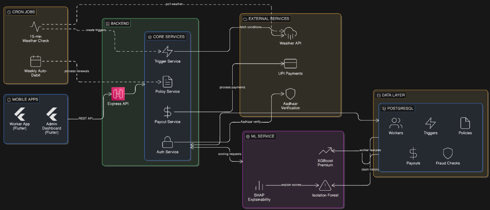

# Phase 2 — System Breakdown
# CODE FOR PHASE 2 ALONGSIDE THE VIDEO : - https://drive.google.com/drive/folders/1mAFovu1oKj91f0TPIvYRUSkfjazje-Z-

## 1. Worker Registration & KYC

- 5-page Flutter onboarding flow (Partner ID → Aadhaar → Zones → Risk Profile → UPI)
- Aadhaar verification using Verhoeff checksum algorithm (real UIDAI validation)
- SHA-256 hashing of Aadhaar — raw number never stored
- One Aadhaar + one phone = one account (DB unique constraints)
- Login screen for returning users (Partner ID + phone lookup)
- Session persistence via SharedPreferences

## 2. Dynamic Premium Engine (ML Module 1)

- XGBoost gradient boosted tree model
- 8 input features: zone risk, monsoon season, claim history, forecast severity, earnings ratio, weeks active, flood-prone zones, zone count
- Zone-count multiplier: +8% per zone beyond 2
- Seasonal adjustment: 1.3x during monsoon months (Oct-Dec)
- Loyalty discount: up to 15% for long-term subscribers
- Output: weekly premium in INR + full breakdown for explainability
- Recalculated on policy activation and renewal

## 3. Insurance Policy Management

- Policy lifecycle: activate → pause → resume → renew → expire
- Coverage toggle in-app (pause/resume with single tap)
- Weekly premium auto-debit date tracking
- Premium history stored per debit cycle
- Zones linked to policy (determines which triggers apply)

## 4. Parametric Trigger System

- 6 trigger categories: rainfall, heat, AQI, bandh/curfew, power outage, order collapse
- Additional types: traffic paralysis, platform outage, election day
- Real-time OpenWeatherMap API integration (Chennai zone coordinates)
- 15-minute automated monitoring cron cycle
- Simulation endpoint for demo triggers
- Time-of-day weighted payout calculation (morning 40%, lunch 60%, afternoon 40%, dinner 70%)
- Auto-resolve after processing

## 5. Fraud Detection Engine (ML Module 2)

- **Layer 1 — Identity Lock:** Aadhaar + phone uniqueness at registration
- **Layer 2 — Duplicate Trigger Check:** Same type+zone blocked within 5 minutes
- **Layer 3 — Weekly Payout Cap:** Cannot exceed declared weekly earnings, auto-trimmed
- **Layer 4 — ML Behavioral Scoring:** Isolation Forest anomaly detection on GPS distance, deliveries during trigger, claim frequency z-score, hours since last claim
- Combined score: 60% rule-based + 40% Isolation Forest
- Three-tier response: approve (<0.3) / review (0.3-0.7) / block (>=0.7)

## 6. SHAP Explainability (ML Module 10)

- KernelExplainer on Isolation Forest model
- Per-signal SHAP values computed for every fraud check
- Rule-based signal contributions added (GPS proximity, activity paradox, claim frequency, cooldown)
- 6-8 signals per check with direction (toward_fraud / away_from_fraud) and contribution percentage
- Displayed in admin dashboard fraud check cards
- Stored in DB as JSONB for audit trail

## 7. Payout Processing

- Automatic payout calculation based on hourly baseline x time-window multiplier x payout rate x overlap hours
- UPI transaction ID simulation on approval
- Three paths: auto-credit (low risk), hold for admin review (medium risk), auto-reject (high risk)
- Admin approve/reject buttons with live UPI transaction generation
- Full breakdown text stored per payout

## 8. Worker Dashboard (Flutter)

- Personalized greeting with real worker data
- Coverage status card with policy details
- Quick stats: total payouts, this month, active zones
- Active trigger alert card (real-time)
- Recent payouts list from API
- 7-day risk forecast bar chart
- Simulate trigger FAB (uses worker's actual zones)
- Pull-to-refresh

## 9. Admin/Insurer Dashboard (Flutter)

- Platform stats: workers, policies, payouts today, fraud flag rate, pending reviews
- **Pending Payouts tab:** Approve/Reject buttons, fraud score bar, SHAP breakdown, payout details
- **Fraud Checks tab:** All fraud checks with risk scores, flags, recommendation, SHAP signals
- **Workers tab:** All workers with policy status, claims count, fraud score, payouts, premium, zones
- **Triggers tab:** Full trigger history with type, zone, intensity, active/resolved status
- Refresh button for live updates

## 10. Backend & Infrastructure

- Node.js + Express API server with request logging (colored status codes, response time)
- PostgreSQL database (7 tables, indexes, constraints)
- FastAPI ML microservice (XGBoost + Isolation Forest + SHAP)
- OpenWeatherMap live weather integration
- API key authentication middleware
- Docker Compose for all services (db, ml_service, backend)
- .env configuration for all secrets

